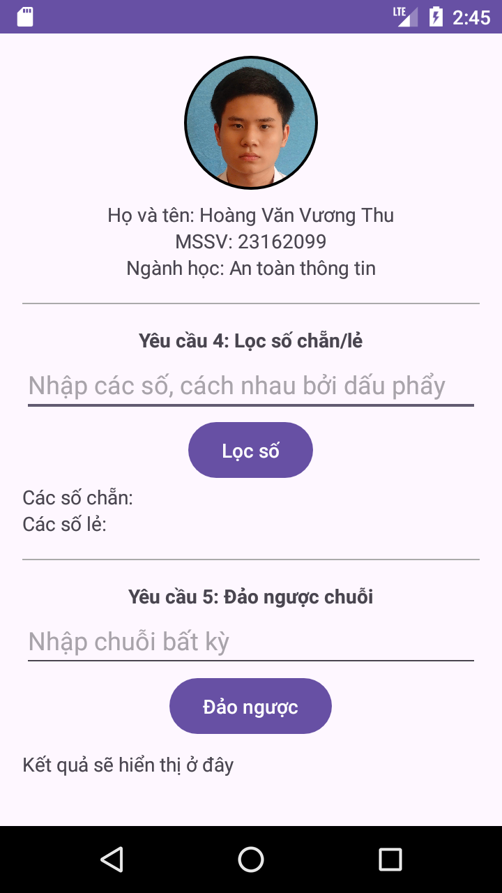
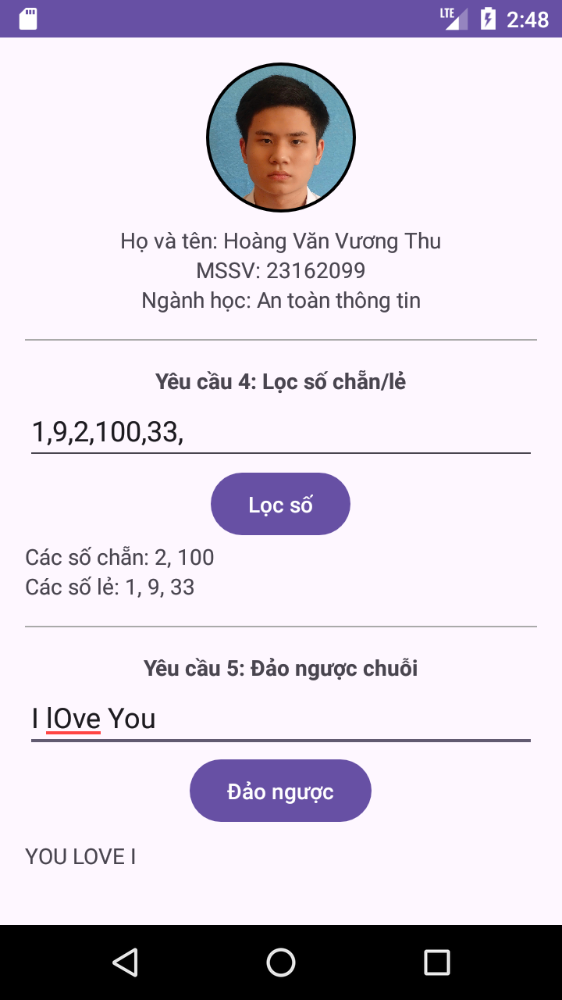
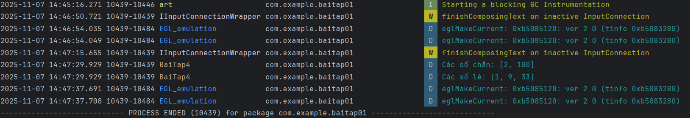

# 🧩 Bài tập 01 - Lập trình di động (Android)

## 📋 Yêu cầu
1. Cài đặt môi trường làm việc với Android Studio  
2. Tạo project `Baitap01` gồm **01 Activity** hiển thị hình và thông tin sinh viên, sử dụng thư viện  
   `de.hdodenhof.circleimageview.CircleImageView` để bo tròn hình ảnh  
3. Ẩn thanh tiêu đề (Title Bar) của ứng dụng  
4. Viết chương trình nhập mảng `ArrayList<Integer>` và in ra **Log.d** các số **chẵn** và **lẻ** riêng biệt  
5. Viết chương trình nhập chuỗi từ `EditText`, in ra `TextView`, và hiển thị `Toast` chuỗi đảo ngược, in hoa  
   - Ví dụ: `"I LOVE YOU"` → `"YOU LOVE I"`

---

## 📷 Hình minh chứng

---

**Sinh viên:** Hoàng Văn Vương Thu  
**MSSV:** 23162099  
**Trường:** ĐH Sư phạm Kỹ thuật Tp.HCM
