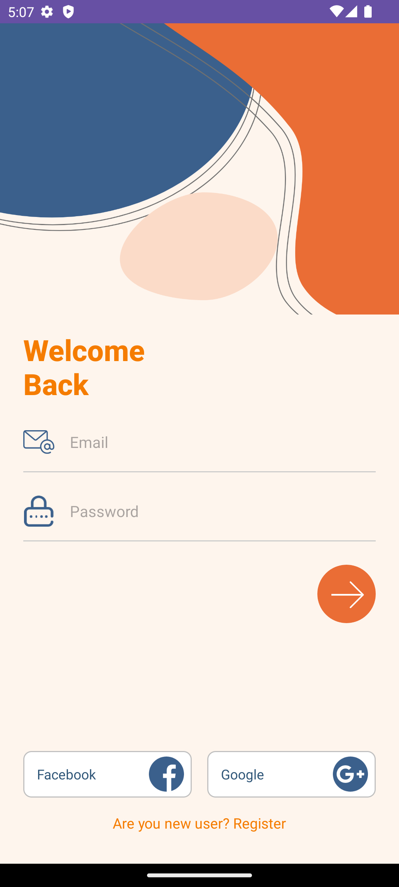
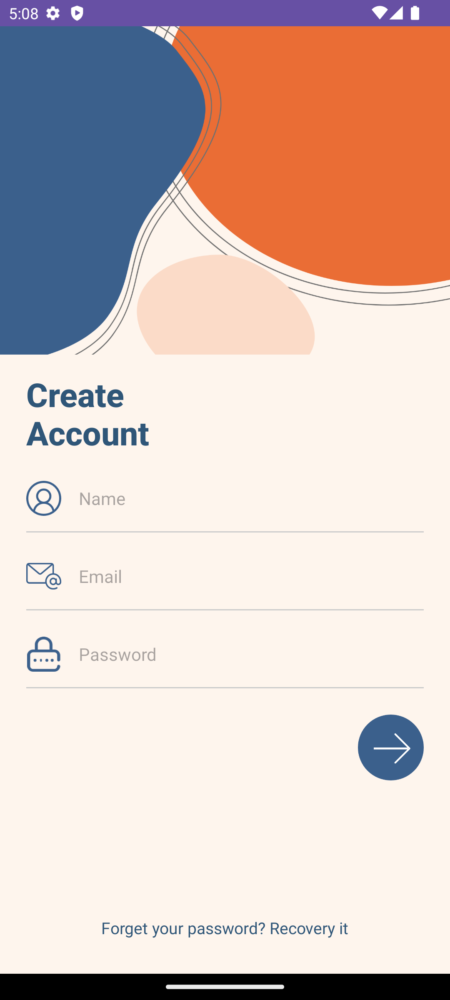

# 🧩 Bài tập 02 - Lập trình di động (Android)

## 📋 Yêu cầu
Làm bài tập số 1 (giao diện login và register) trong slide

Deadline  22g30 ngày 15/11/2025
---

## 📷 Hình minh chứng
<figure>
  
  <figcaption><strong>Hình 1.</strong> Màn hình Login — gồm email, password, nút đăng nhập và login bằng Facebook/Google.</figcaption>
</figure>

<figure>
  
  <figcaption><strong>Hình 2.</strong> Màn hình Register — người dùng nhập tên, email, mật khẩu và nút đăng ký.</figcaption>
</figure>

---

**Sinh viên:** Hoàng Văn Vương Thu  
**MSSV:** 23162099  
**Trường:** ĐH Sư phạm Kỹ thuật Tp.HCM
