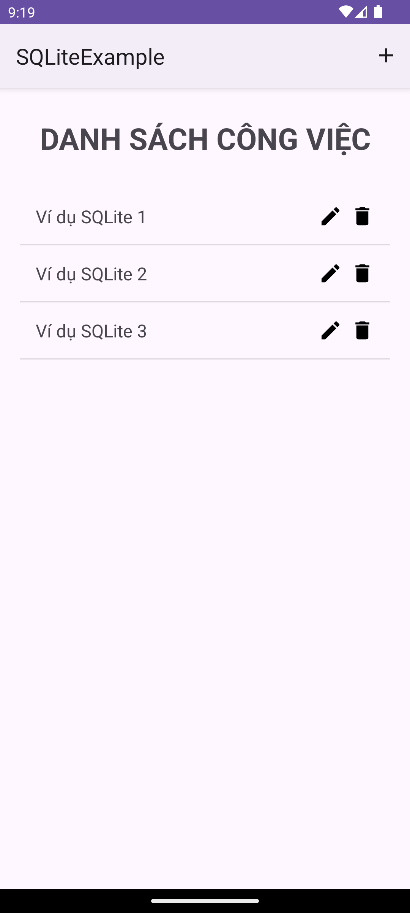
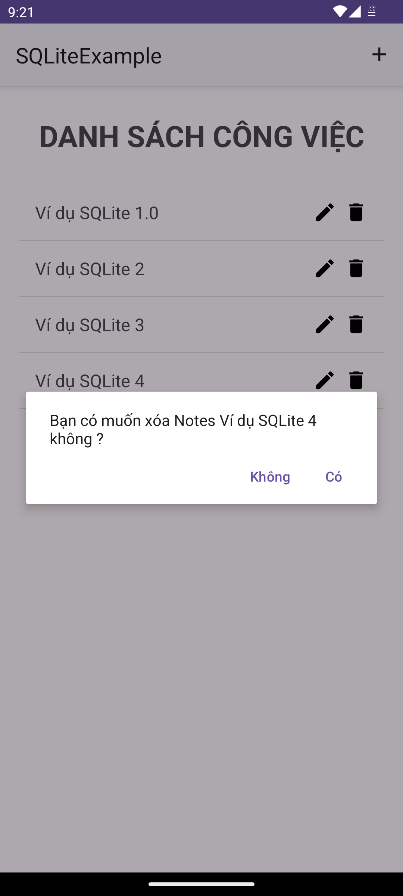

# 🧩 Bài tập 04 - Lập trình di động (Android)

## 📋 Yêu cầu
**SQLite trong Android**   

1. **Sử dụng SQLiteOpenHelper** để tạo và quản lý database.  
2.  **Hiển thị dữ liệu:** Đọc dữ liệu từ bảng `Notes` và hiển thị danh sách các công việc ra.  
3.  **Thêm dữ liệu:** Có chức năng thêm công việc mới vào cơ sở dữ liệu.  
4.  **Chỉnh sửa dữ liệu** Chỉnh sửa nội dung công việc hoặc xoá công việc.  

Deadline  10g45 ngày 20/11/2025

---

## 📷 Hình minh chứng
<figure>
  
  <figcaption style="margin-top: 12px;">
    <strong>Hình 1.</strong> Màn hình chính SQLiteExample, hiển thị danh sách công việc.
  </figcaption>
</figure>

<figure>
  
  <figcaption style="margin-top: 12px;">
    <strong>Hình 2.</strong> Cập nhật nội dung Note.
  </figcaption>
</figure>

<figure>
  
  <figcaption style="margin-top: 12px;">
    <strong>Hình 3.</strong> Toast thông báo cập nhật thành công note.
  </figcaption>
</figure>

<figure>
  
  <figcaption style="margin-top: 12px;">
    <strong>Hình 4.</strong> Chức năng thêm note mới.
  </figcaption>
</figure>

<figure>
  
  <figcaption style="margin-top: 12px;">
    <strong>Hình 5.</strong> Toast thông báo thêm note mới thành công.
  </figcaption>
</figure>

<figure>
  
  <figcaption style="margin-top: 12px;">
    <strong>Hình 6.</strong> Chức năng xoá note.
  </figcaption>
</figure>

<figure>
  
  <figcaption style="margin-top: 12px;">
    <strong>Hình 7.</strong> Toast thông báo xoá note thành công.
  </figcaption>
</figure>
  
---

**Sinh viên:** Hoàng Văn Vương Thu  
**MSSV:** 23162099  
**Trường:** ĐH Sư phạm Kỹ thuật Tp.HCM
