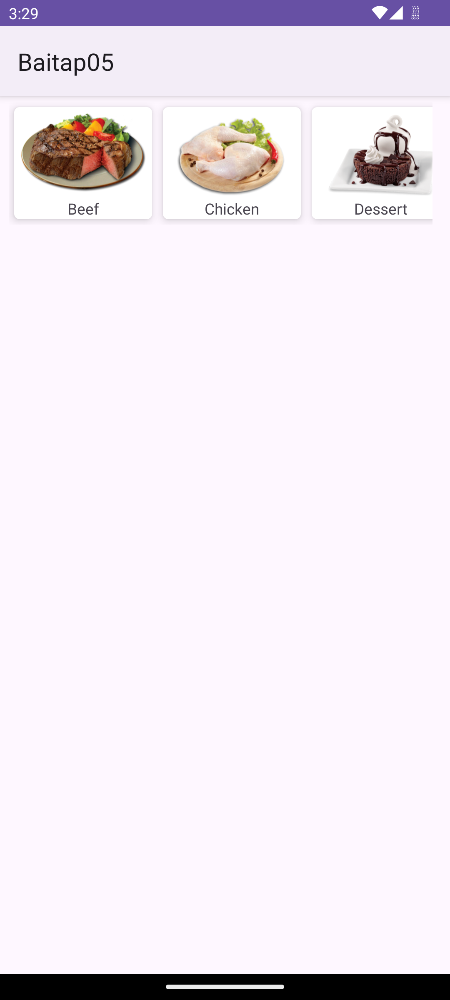
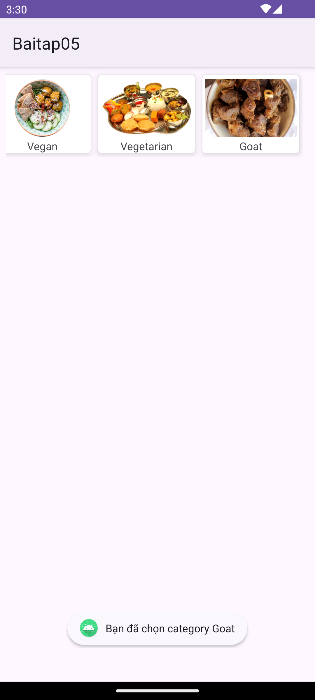

# 🧩 Bài tập 05 - Lập trình di động (Android)

## 📋 Yêu cầu  
**Kết nối API với thư viện Retrofit2**  

1. **Thiết kế giao diện**
2. **Cài đặt thư viện retrofit**  
3. **Thêm cài đặt quyền truy cập internet**  
4. **Chuẩn bị API**   
5. **Chuẩn bị Model**  
6. **Định nghĩa Retrofit Client**  
7. **Định nghĩa API Interface**  
8. **Tạo Adapter cho RecyclerView**
9. **Thực hiện request**  

Deadline  16g03 ngày 21/11/2025

---

## 📷 Hình minh chứng
<figure>
  
  <figcaption style="margin-top: 12px;">
    <strong>Hình 1.</strong> Hiển thị giao diện.  
  </figcaption>
</figure>

<figure>
  
  <figcaption style="margin-top: 12px;">
    <strong>Hình 2.</strong> Toast thông báo khi chọn món ăn.  
  </figcaption>
</figure>  

---

**Sinh viên:** Hoàng Văn Vương Thu  
**MSSV:** 23162099  
**Trường:** ĐH Sư phạm Kỹ thuật Tp.HCM
