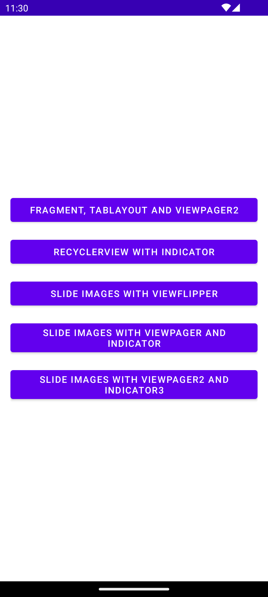

# 🧩 Bài tập 06 - Lập trình di động (Android)

## 📋 Yêu cầu  
**Sử dụng viewFlipper, Viewpager, Fragment trong Android và làm các ví dụ và bài tập trong hướng dẫn.**  

Deadline 23g ngày 28/11/2025

---

## 📷 Hình minh chứng
<figure>
  
  <figcaption style="margin-top: 12px;">
    <strong>Hình 1.</strong> Giao diện menu các bài tập và ví dụ.  
  </figcaption>
</figure>

<figure>
  
  <figcaption style="margin-top: 12px;">
    <strong>Hình 2.</strong> Giao diện Fragment, Tablayout and Viewpager2.  
  </figcaption>
</figure>  

<figure>
  
  <figcaption style="margin-top: 12px;">
    <strong>Hình 3.</strong> Chuyển tab đổi icon.  
  </figcaption>
</figure>  

<figure>
  
  <figcaption style="margin-top: 12px;">
    <strong>Hình 4.</strong> Giao diện RecyclerView.  
  </figcaption>
</figure>  

<figure>
  
  <figcaption style="margin-top: 12px;">
    <strong>Hình 5.</strong> Slide Images with ViewFlipper.  
  </figcaption>
</figure>  

<figure>
  
  <figcaption style="margin-top: 12px;">
    <strong>Hình 6.</strong> Slide Images with ViewPager and Indicator chuyển ảnh theo chiều ngang.  
  </figcaption>
</figure>  

<figure>
  
  <figcaption style="margin-top: 12px;">
    <strong>Hình 7.</strong> Slide Images with ViewPager2 and Indicator3.  
  </figcaption>
</figure>  

<figure>
  
  <figcaption style="margin-top: 12px;">
    <strong>Hình 8.</strong> Slide Images with ViewPager2 and Indicator3 chuyển ảnh theo chiều dọc.  
  </figcaption>
</figure>  

---

**Sinh viên:** Hoàng Văn Vương Thu  
**MSSV:** 23162099  
**Trường:** ĐH Sư phạm Kỹ thuật Tp.HCM
