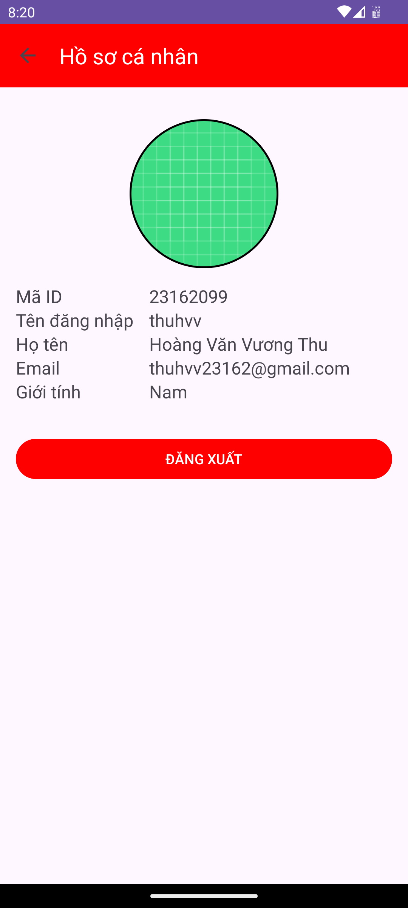
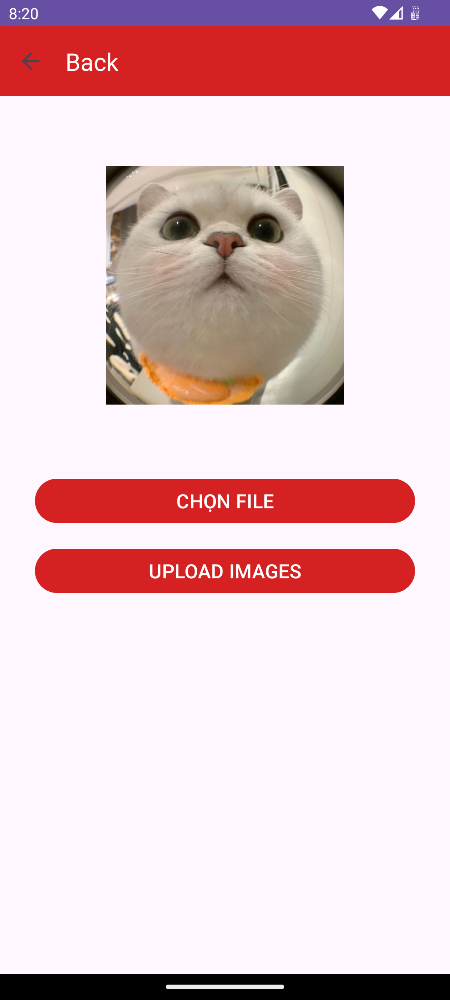
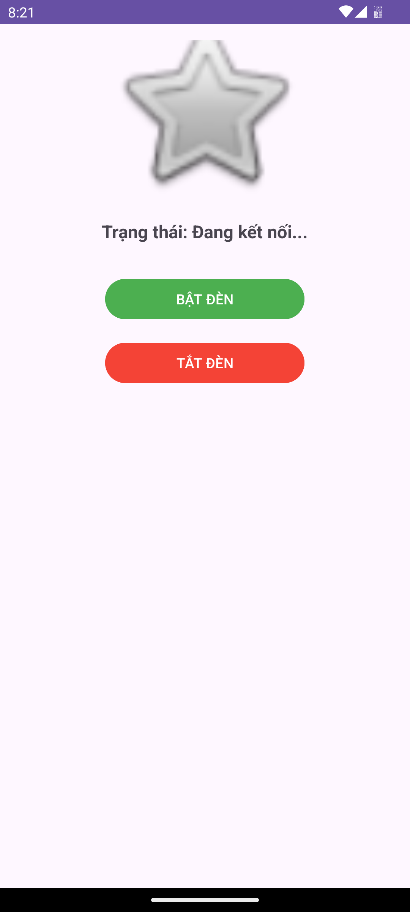
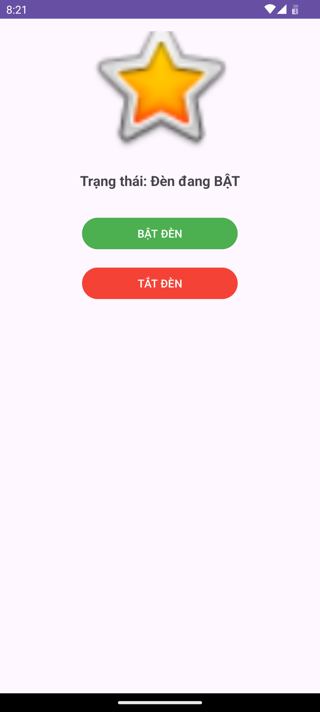
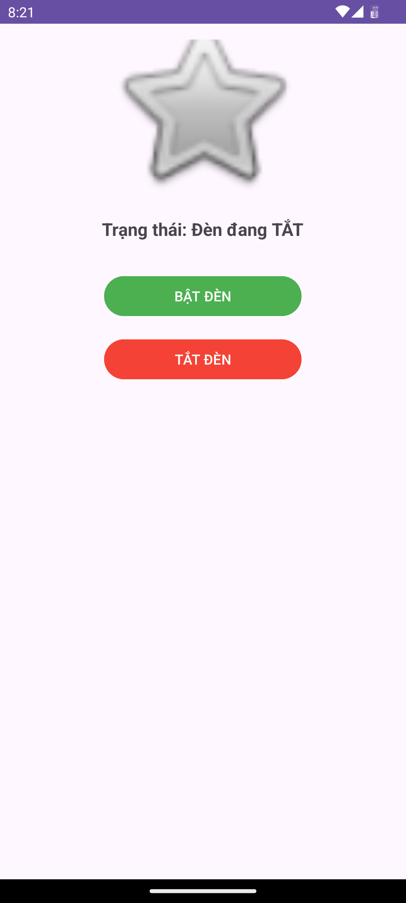

# 🧩 Bài tập 07 - Lập trình di động (Android)

## 📋 Yêu cầu  
**Upload images qua API.**  
**Thực hiện theo ví dụ socket, điều khiển bật/tắt thiết bị.**  

Deadline 10g37 ngày 04/12/2025

---

## 📷 Hình minh chứng
<figure>
  
  <figcaption style="margin-top: 12px;">
    <strong>Hình 1.</strong> Giao diện trang cá nhân.  
  </figcaption>
</figure>

<figure>
  
  <figcaption style="margin-top: 12px;">
    <strong>Hình 2.</strong> Chọn avatar thành công.  
  </figcaption>
</figure>  

<figure>
  
  <figcaption style="margin-top: 12px;">
    <strong>Hình 3.</strong> Toast thông báo update image thành công qua API.  
  </figcaption>
</figure>  

<figure>
  
  <figcaption style="margin-top: 12px;">
    <strong>Hình 4.</strong> Trạng thái socket thông báo chờ kết nối.  
  </figcaption>
</figure>  

<figure>
  
  <figcaption style="margin-top: 12px;">
    <strong>Hình 5.</strong> Bật thiết bị thành công.  
  </figcaption>
</figure>  

<figure>
  
  <figcaption style="margin-top: 12px;">
    <strong>Hình 6.</strong> Tắt thiết bị thành công.
  </figcaption>
</figure>  

---

**Sinh viên:** Hoàng Văn Vương Thu  
**MSSV:** 23162099  
**Trường:** ĐH Sư phạm Kỹ thuật Tp.HCM
