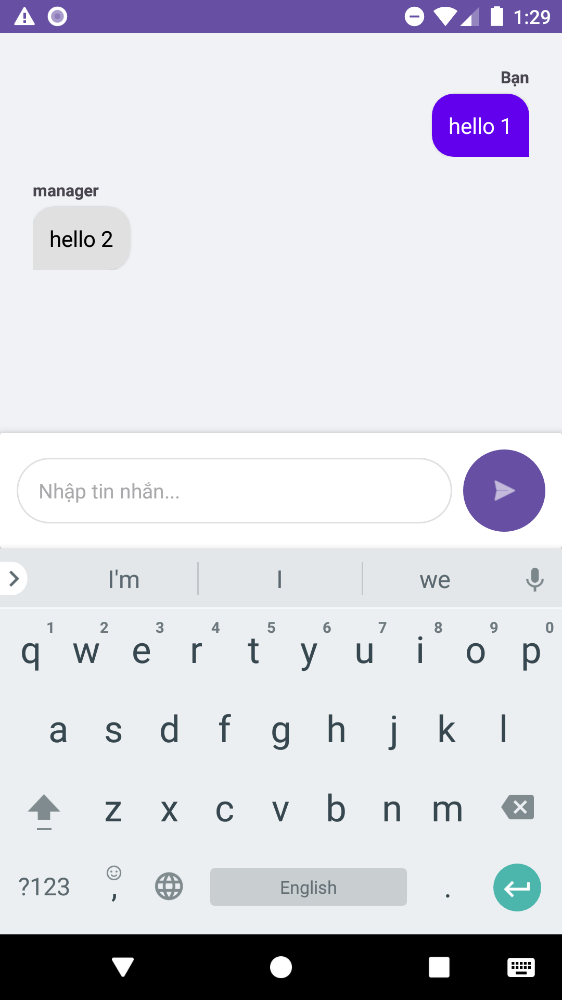
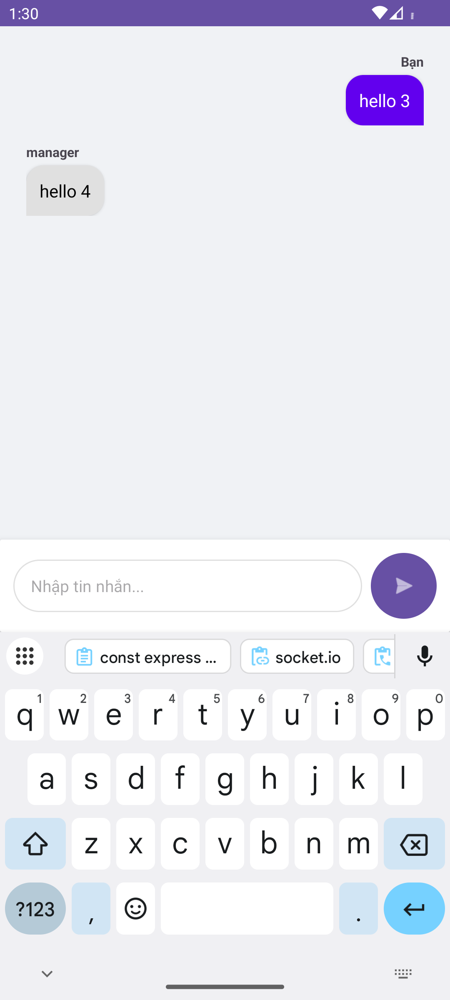
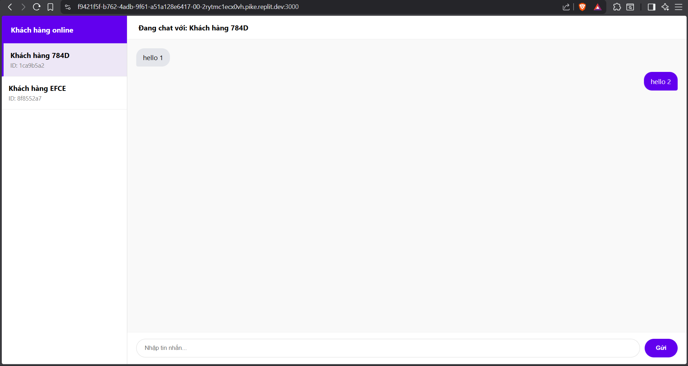
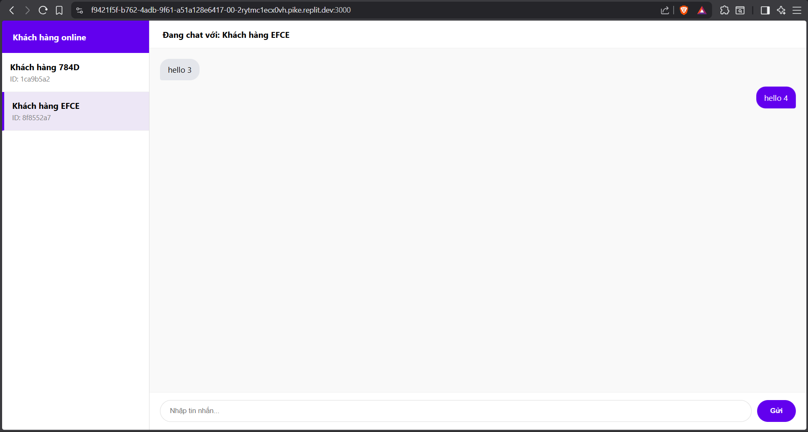
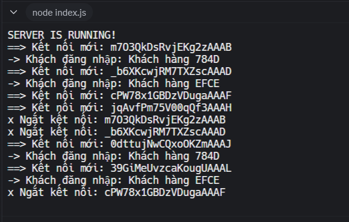

# 🧩 Bài tập 09 - Lập trình di động (Android)

## 📋 Yêu cầu  
**Tìm hiểu về socketIO.**  
**Viết chức năng Hỗ trợ khách hàng (chat realtime) giữa customer và manager.**    

Deadline 23g45 ngày 12/12/2025
  
---  

**Sử dụng Replit + Node.js để viết SocketIO chat server.**  
## 📷 Hình minh chứng  
<figure>
  
  <figcaption style="margin-top: 12px;">
    <strong>Hình 1.</strong> Customer thứ nhất chat với manager và được phản hồi.  
  </figcaption>
</figure>  
  
<figure>
  
  <figcaption style="margin-top: 12px;">
    <strong>Hình 2.</strong> Customer thứ hai chat với manager và được phản hồi.  
  </figcaption>
</figure>  

<figure>
  
  <figcaption style="margin-top: 12px;">
    <strong>Hình 3.</strong> Manager phản hồi khách hàng thứ nhất.  
  </figcaption>
</figure>   
  
<figure>
  
  <figcaption style="margin-top: 12px;">
    <strong>Hình 4.</strong> Manager phản hồi khách hàng thứ hai.   
  </figcaption>
</figure>  
  
<figure>
  
  <figcaption style="margin-top: 12px;">
    <strong>Hình 5.</strong> Log thông báo từ console của SocketIO.  
  </figcaption>
</figure>  
    
  
---  

**Sinh viên:** Hoàng Văn Vương Thu  
**MSSV:** 23162099  
**Trường:** ĐH Sư phạm Kỹ thuật Tp.HCM
