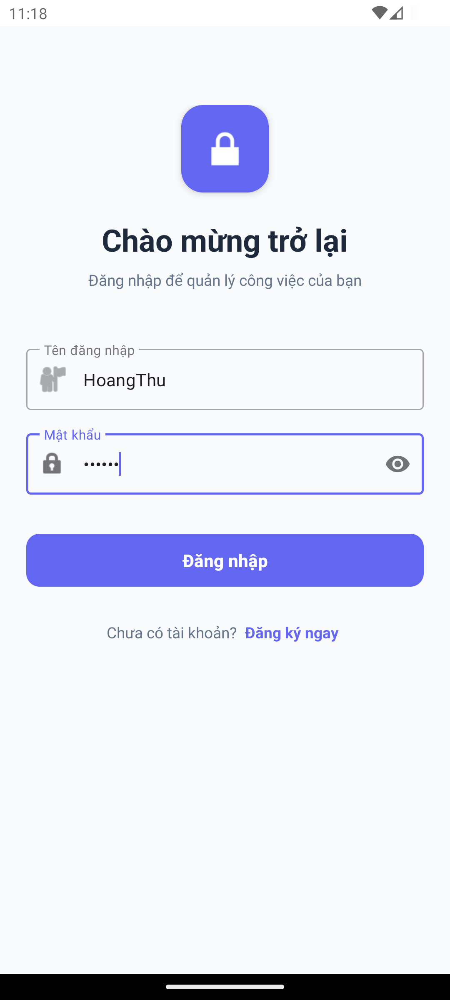
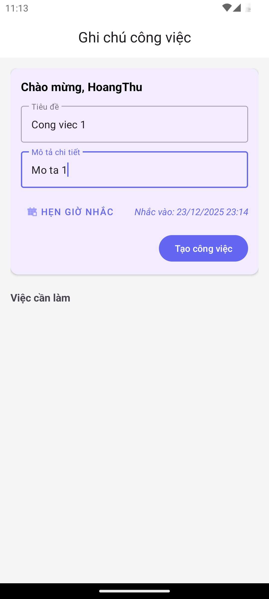
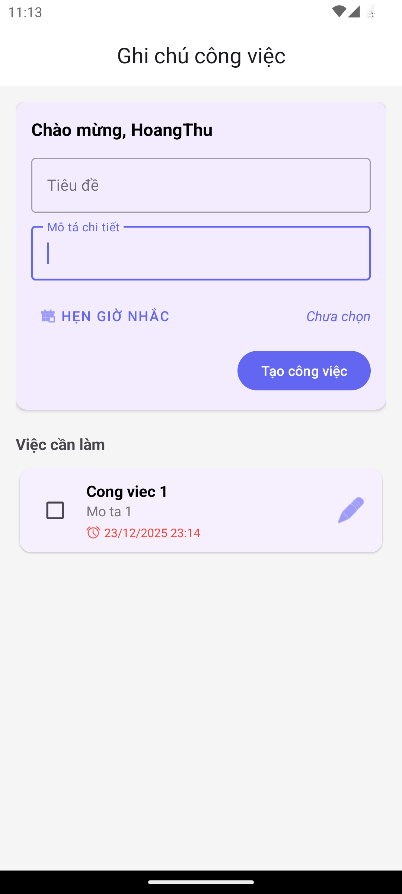
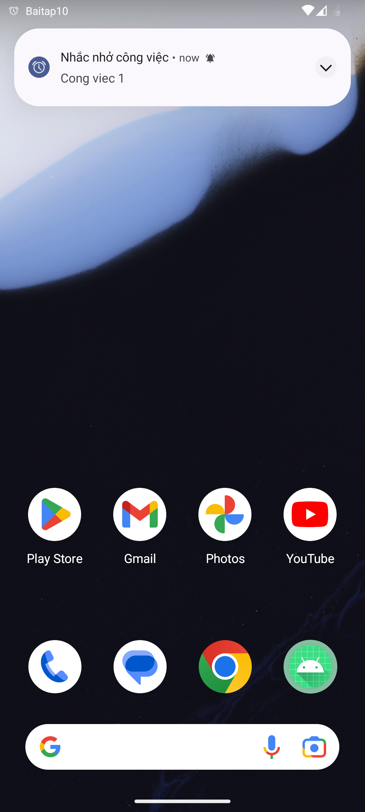
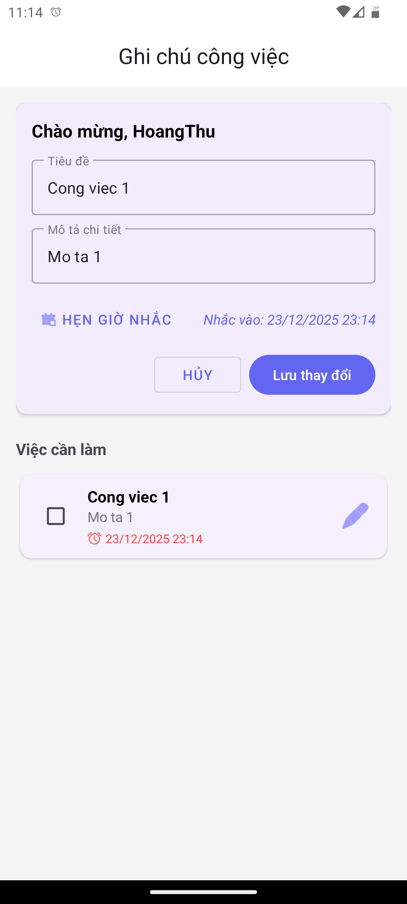
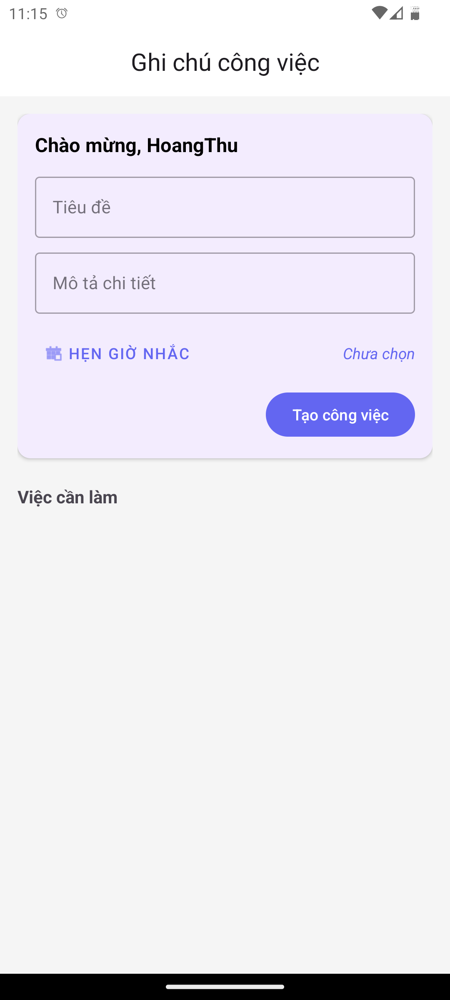

# 🧩 Bài tập 10 - Lập trình di động (Android)

## 📋 Yêu cầu  
**Viết 01 App ToDoList bằng Kotlin có các chức năng: đăng ký tài khoản, đăng nhập, thêm xóa sửa, xem các công việc hàng ngày của mình. Dữ liệu công việc được luu trữ trong SQL Lite**   

Deadline 10g45 ngày 18/12/2025
  
---  

## 📷 Hình minh chứng  
<figure>
  
  <figcaption style="margin-top: 12px;">
    <strong>Hình 1.</strong> Giao diện đăng nhập và đăng ký tài khoản.  
  </figcaption>
</figure>  
  
<figure>
  
  <figcaption style="margin-top: 12px;">
    <strong>Hình 2.</strong> Thêm công việc mới với tiêu đề, mô tả, giờ nhắc nhở đến hạn.  
  </figcaption>
</figure>  

<figure>
  
  <figcaption style="margin-top: 12px;">
    <strong>Hình 3.</strong> Hoàn tất thêm công việc mới và xuất hiện trong danh sách Việc cần làm.  
  </figcaption>
</figure>   
  
<figure>
  
  <figcaption style="margin-top: 12px;">
    <strong>Hình 4.</strong> Thông báo nhắc nhỏ khi đến hạn của công việc.   
  </figcaption>
</figure>  
  
<figure>
  
  <figcaption style="margin-top: 12px;">
    <strong>Hình 5.</strong> Chỉnh sửa ghi chú, bao gồm toàn bộ tiêu để, mô tả, ngày nhắc nhở.  
  </figcaption>
</figure>  
  
<figure>
  
  <figcaption style="margin-top: 12px;">
    <strong>Hình 6.</strong> Khi công việc hoàn tất, tích vào ô vuông bên trái và ghi chú được xoá khỏi Viêc cần làm.  
  </figcaption>
</figure>  
  
---  

**Sinh viên:** Hoàng Văn Vương Thu  
**MSSV:** 23162099  
**Trường:** ĐH Sư phạm Kỹ thuật Tp.HCM
