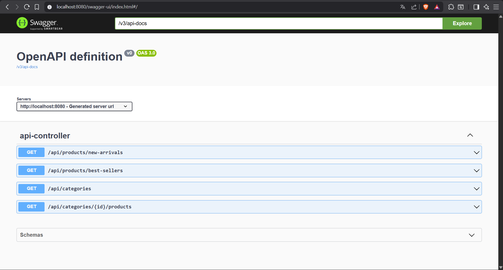
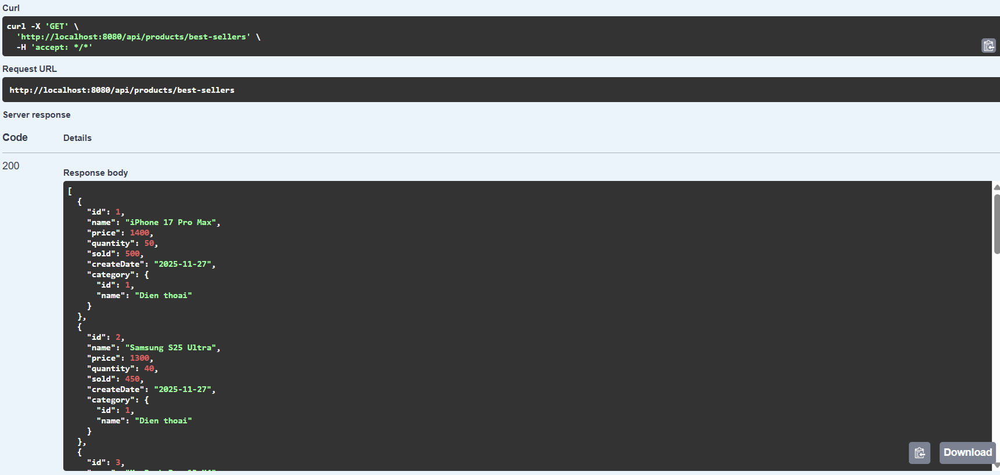
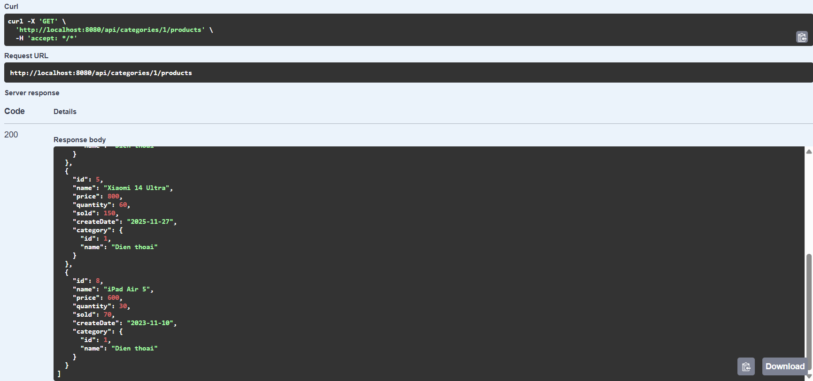

# 🧩 Bài tập API - Lập trình di động (Android)

## 📋 Yêu cầu  
**Thực hiện các API sau:**  

1. **Hiển thị tất cả danh mục của đề tài**
2. **Hiển thị tất cả sản phẩm theo từng danh mục**  
3. **Hiển thị 10 sản phẩm có số lượng bán nhiều nhất**  
4. **Hiển thị 10 sản phẩm được tạo dưới 7 ngày**   

Deadline  23g33 ngày 27/11/2025
Bài tập sử dụng Framework Spring Boot 3.5.8  

---

## 📷 Hình minh chứng
<figure>
  
  <figcaption style="margin-top: 12px;">
    <strong>Hình 1.</strong> Trang chủ.  
  </figcaption>
</figure>

<figure>
  
  <figcaption style="margin-top: 12px;">
    <strong>Hình 2.</strong> Hiển thị 10 sản phẩm có số lượng bán nhiều nhất.  
  </figcaption>
</figure>  

<figure>
  
  <figcaption style="margin-top: 12px;">
    <strong>Hình 3.</strong> Hiển thị 10 sản phẩm được tạo dưới 7 ngày.  
  </figcaption>
</figure>  

<figure>
  
  <figcaption style="margin-top: 12px;">
    <strong>Hình 4.</strong> Hiển thị tất cả danh mục.  
  </figcaption>
</figure>  

<figure>
  
  <figcaption style="margin-top: 12px;">
    <strong>Hình 5.</strong> Hiển thị tất cả sản phẩm theo danh mục (Điện thoại).  
  </figcaption>
</figure>  
  
---

**Sinh viên:** Hoàng Văn Vương Thu  
**MSSV:** 23162099  
**Trường:** ĐH Sư phạm Kỹ thuật Tp.HCM
